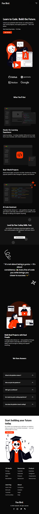
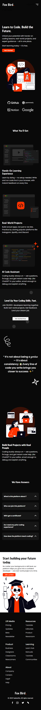

# Fox Bird - Learn to Code, Build the Future

Fox Bird is a modern, interactive coding platform designed to help beginners and experienced developers level up their programming skills through hands-on learning, real-world projects, and AI-assisted guidance. Built with SCSS, vanilla JavaScript, and Lottie animations, this platform delivers a visually engaging and intuitive learning experience.


## Features

- **Hands-On Learning Experience**: Write, run, and test code directly in your browser with instant feedback. Learn by doing without any setup or complex configurations.

- **Interactive Animations**: Engaging Lottie animations enhance the learning experience, making tutorials and guides visually appealing.

- **Responsive & Modern UI**: SCSS-based styling ensures a consistent, responsive, and modern interface across all devices.

- **Modern Styling**: Utilizes SCSS for modular and maintainable CSS, with variables for consistent theming.

## Technologies Used

- **HTML5**: For structuring the content.
- **SCSS**: For styling with variables, mixins, and nested rules.
- **Font Awesome**: For icons.
**Lottie Animations** Lottie Animations for interactive UI
- **Google Fonts**: For typography (Raleway and Poppins).
**Responsive Design** : Responsive Design for all devices

## Folder Structure

│   index.html
│
├───images
├───lottie
├───script
├───scss
│   ├───components
│   ├───global
│   └───utils


Check out the live preview of the website:  
   👉 [Live Preview](https://saidoshits.github.io/Fox-Bird/)

## Preview

Here are some previews of the website:

### Desktop View


### Tablet View


### Mobile View


## Setup Instructions

1. **Clone the Repository**:
   ```bash
   git clone https://github.com/SaidosHits/
   cd your-repo-name
